I completed [Hacking with Swift's](https://www.hackingwithswift.com/) [100 Days of SwiftUI](https://www.hackingwithswift.com/100/swiftui) course, a free collection of videos, tutorials, tests, and more, all drawn from Hacking with Swift's work, and all designed to help learn SwiftUI effectively. To demonstrate my progress in developing iOS apps, I uploaded 6 milestone projects to Github Repositories.

---

    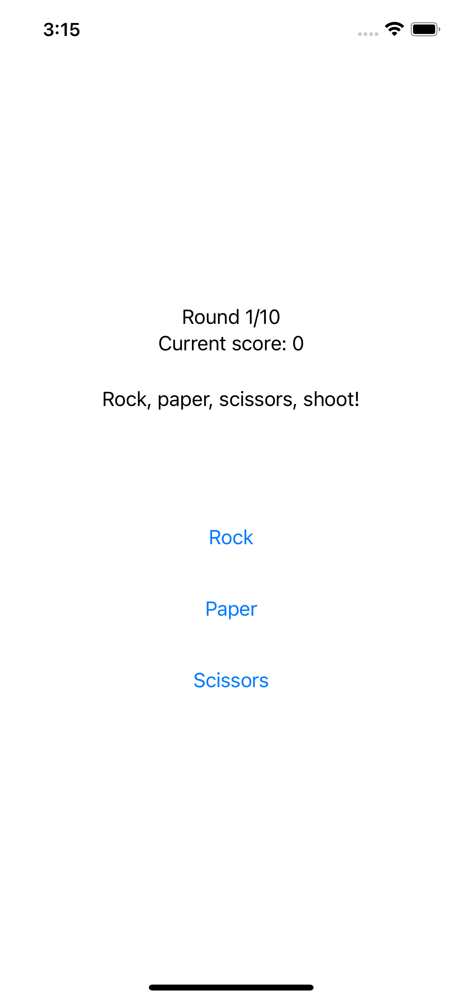
    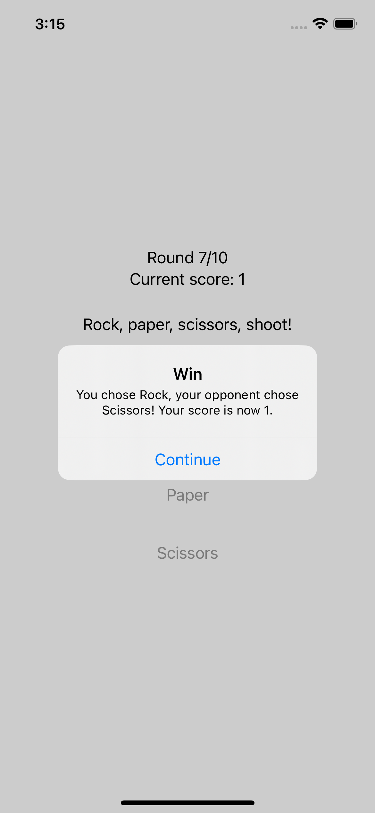
    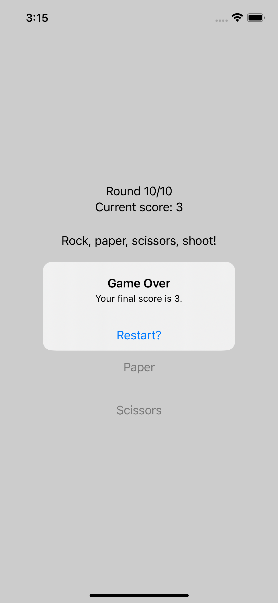

[Github repository of Milestone 1 (projects 1-3)](https://github.com/caojieming/SwiftUI-P3.5-Rock-Paper-Scissors): An app for playing a 10 round game of rock paper scissors.

---

    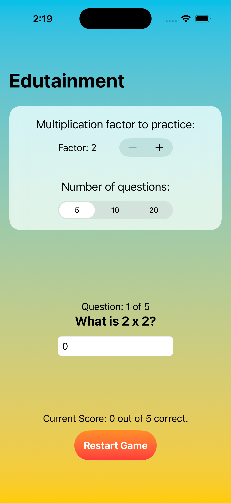
    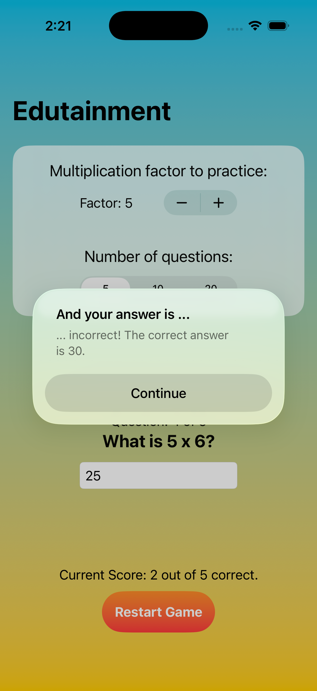
    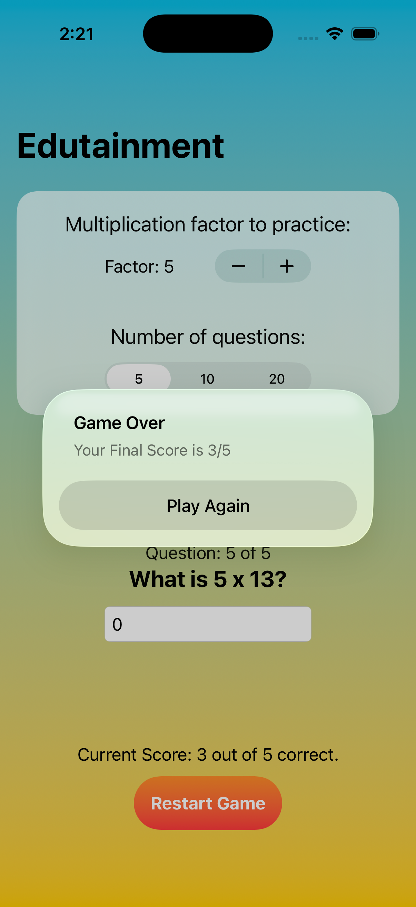

[Github repository of Milestone 2 (projects 4-6)](https://github.com/caojieming/SwiftUI-P6.5-Edutainment): An app for kids to help them practice multiplication tables.

---

    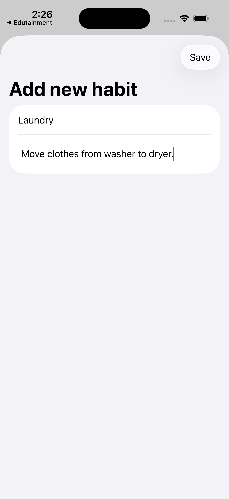
    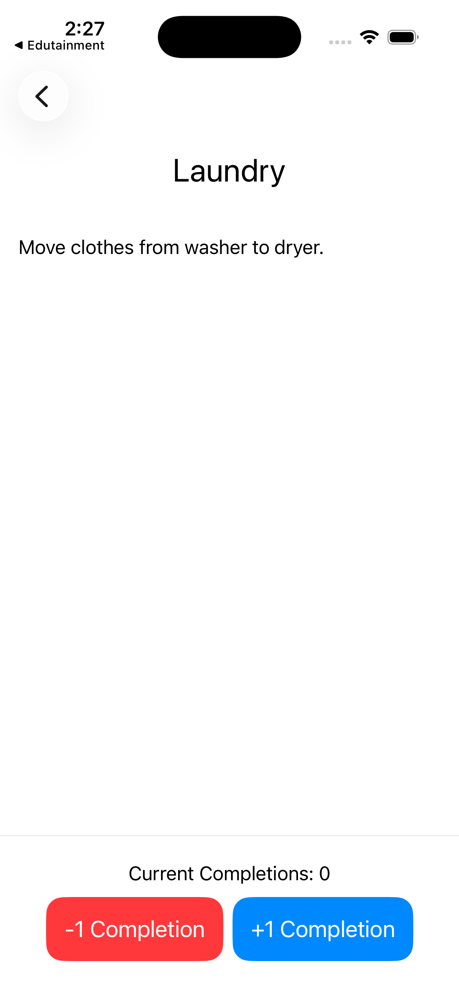
    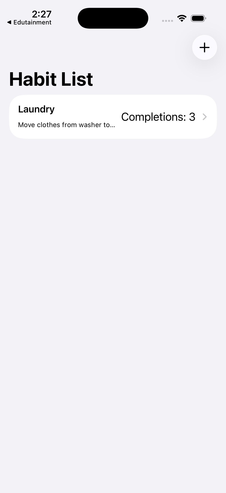

[Github repository of Milestone 3 (projects 7-9)](https://github.com/caojieming/SwiftUI-P9.5-Habits): A habit-tracking app for people who want to keep track of how much they do certain activities.

---

    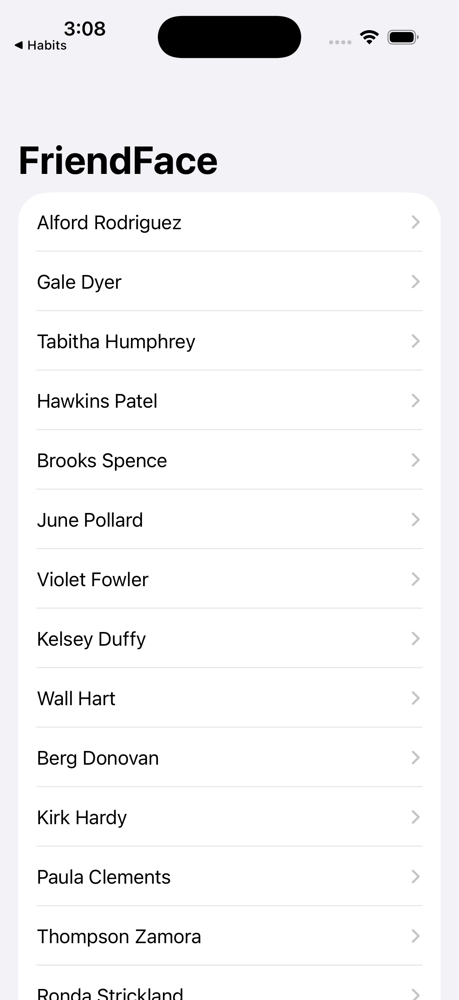
    
    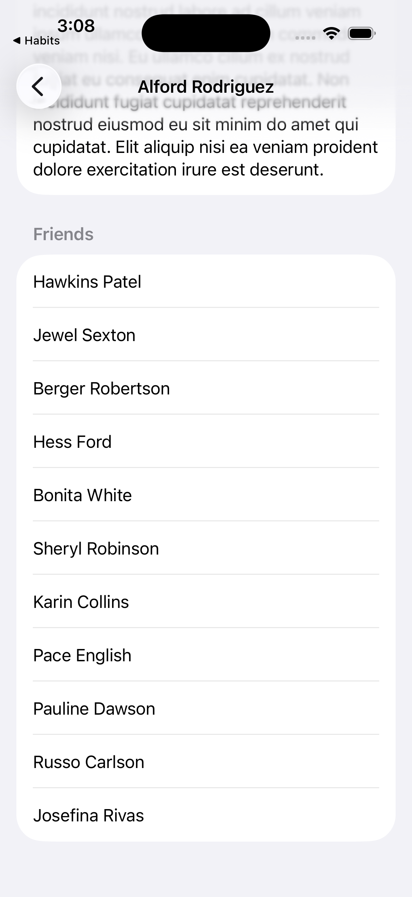

[Github repository of Milestone 4 (projects 10-12)](https://github.com/caojieming/SwiftUI-P12.5-FriendFace): An app that downloads JSON Data from a URL and displays it in a list.

---

    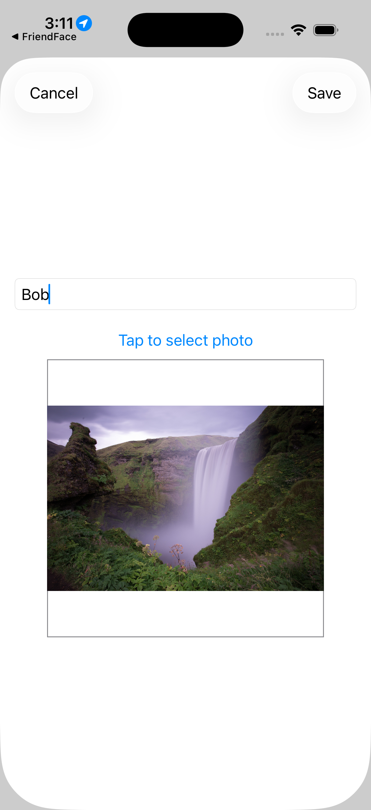
    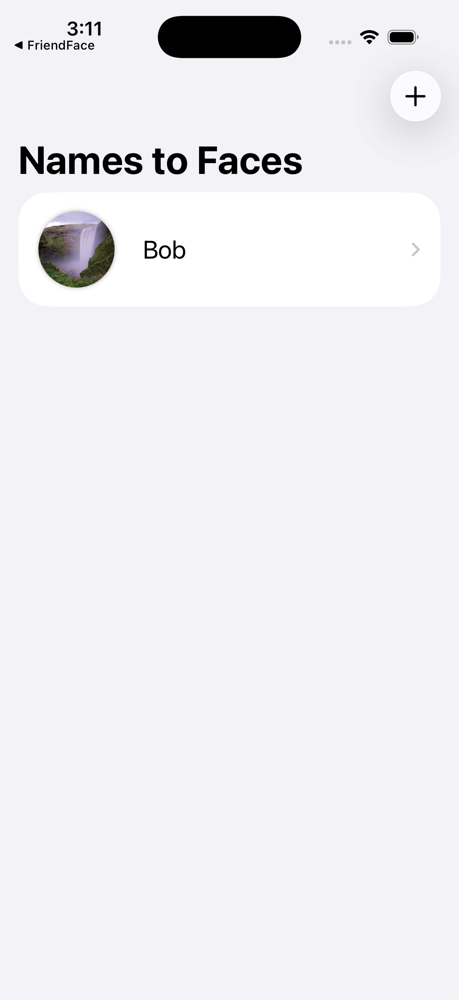
    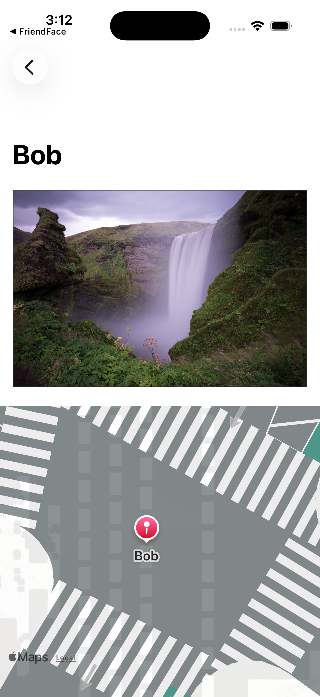

[Github repository of Milestone 5 (projects 13-15)](https://github.com/caojieming/SwiftUI-P15.5-NamedPhotos): An app for helping users remember names to faces.

---

    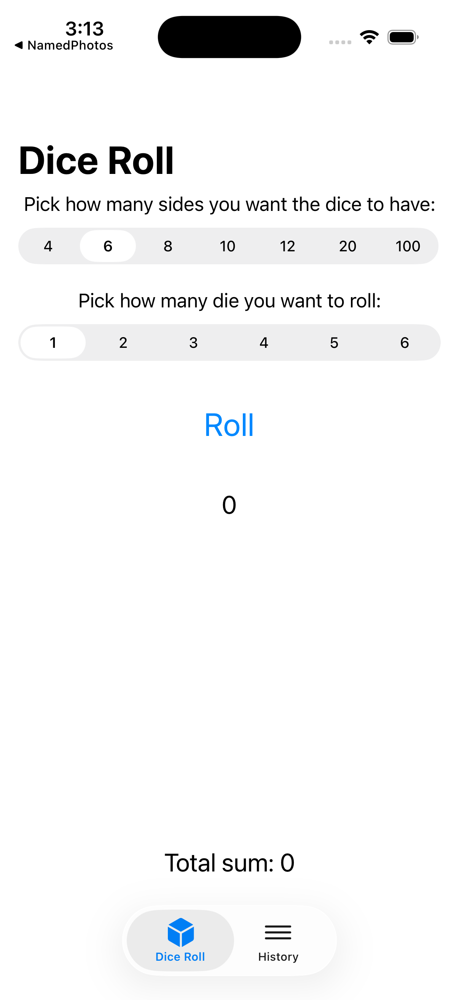
    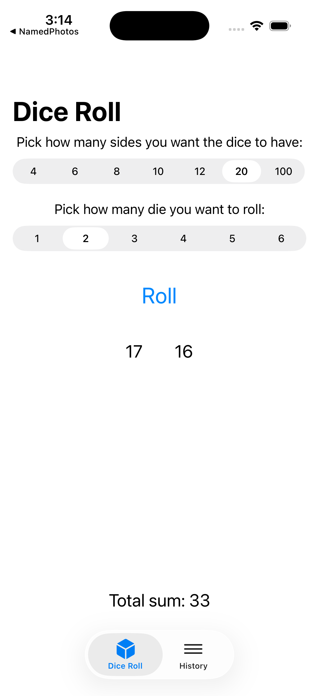
    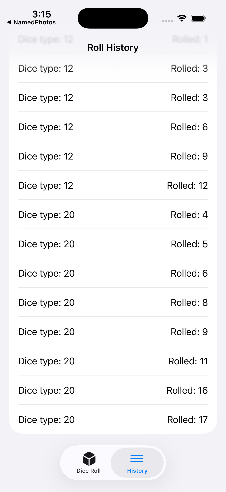

[Github repository of Milestone 6 (projects 16-18)](https://github.com/caojieming/SwiftUI-P18.5-DiceRoll): An app that lets users roll a dice and see results from previous rolls.

<!--more-->
